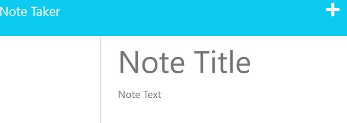

# NoteTaker-App

 ## Table of conten
 - [Description](#description)
 - [Visuals](#visuals)
 - [Links](#links)

 ***

 ## Description
The purpose of the challenge was to create an application that could be used to write and save notes in an 

organized fashion. This application will use Express.js and retrieve note data from a Json file. 

We used Heroku to deploy this challenge for anyone to use. 

 ***

 ## Visuals
Home Screen

Notes Section

Notes Saved

Heroku Log

 ***

 ## Links 
Link to GitHub: [NoteTaker-App2](https://github.com/KMPhillips20/NoteTaker-App2)

Link to Heroku: [Heroku](https://dashboard.heroku.com/apps/dry-thicket-37346)
 ***